  

  

 

  

<!-- Snake contribution animation — generated by .github/workflows/snake.yml, committed to the "output" branch -->
<picture>
  <source media="(prefers-color-scheme: dark)" srcset="https://raw.githubusercontent.com/nl2992/nl2992/output/github-contribution-grid-snake-dark.svg" />
  <source media="(prefers-color-scheme: light)" srcset="https://raw.githubusercontent.com/nl2992/nl2992/output/github-contribution-grid-snake.svg" />
  
</picture>

  

