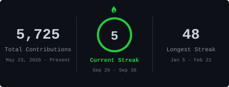

<a href="https://nl2992.github.io/nl2992/" title="Open the interactive terminal">
  <picture>
    <source media="(prefers-color-scheme: light)" srcset="https://raw.githubusercontent.com/nl2992/nl2992/main/assets/banner-light.svg" />
    <source media="(prefers-color-scheme: dark)" srcset="https://raw.githubusercontent.com/nl2992/nl2992/main/assets/banner.svg" />
    
  </picture>
</a>

<a href="https://nl2992.github.io/nl2992/">
  <picture>
    <source media="(prefers-color-scheme: light)" srcset="https://img.shields.io/badge/%E2%96%B6_this_terminal_is_real-click_to_type_in_it-1a7f37?style=flat-square&labelColor=f6f8fa" />
    <source media="(prefers-color-scheme: dark)" srcset="https://img.shields.io/badge/%E2%96%B6_this_terminal_is_real-click_to_type_in_it-27c93f?style=flat-square&labelColor=0d1117" />
    
  </picture>
</a>

 

### Hey, I'm Nigel

Math at Columbia. Most days I'm either three hours into getting something to work or
three minutes from breaking it again.

Before this it was CS and Commerce at UNSW in Sydney, plus three and a half years as a
Casual Academic teaching econometrics and micro (ECON2206, ECON1101, COMM1100) to rooms
that mainly wanted to know if it was on the exam. Still teaching, now MATH GR5300 here.

Desk time: HSBC Global Markets in Hong Kong, plus Challenger Investment Management,
Wellington Management and Ernst & Young in Sydney. At EY I was building multi-agent
systems back when that was still filed under "data project" rather than AI.

This year my team won the 15th IAQF Student Affiliate Competition, and a paper on
CVaR-constrained RL got into ICAIF 2026. Right now I'm building a Fourier option pricer,
mostly because pricing things with integrals never stops being satisfying.

Otherwise: on a mountain, or in the kitchen.

 

<picture>
  <source media="(prefers-color-scheme: light)" srcset="https://img.shields.io/badge/Python-f6f8fa?style=flat-square&logo=python&logoColor=1a7f37" />
  <source media="(prefers-color-scheme: dark)" srcset="https://img.shields.io/badge/Python-0d1117?style=flat-square&logo=python&logoColor=7ee787" />
  
</picture>
<picture>
  <source media="(prefers-color-scheme: light)" srcset="https://img.shields.io/badge/Jupyter-f6f8fa?style=flat-square&logo=jupyter&logoColor=1a7f37" />
  <source media="(prefers-color-scheme: dark)" srcset="https://img.shields.io/badge/Jupyter-0d1117?style=flat-square&logo=jupyter&logoColor=7ee787" />
  
</picture>
<picture>
  <source media="(prefers-color-scheme: light)" srcset="https://img.shields.io/badge/pandas-f6f8fa?style=flat-square&logo=pandas&logoColor=1a7f37" />
  <source media="(prefers-color-scheme: dark)" srcset="https://img.shields.io/badge/pandas-0d1117?style=flat-square&logo=pandas&logoColor=7ee787" />
  
</picture>
<picture>
  <source media="(prefers-color-scheme: light)" srcset="https://img.shields.io/badge/NumPy-f6f8fa?style=flat-square&logo=numpy&logoColor=1a7f37" />
  <source media="(prefers-color-scheme: dark)" srcset="https://img.shields.io/badge/NumPy-0d1117?style=flat-square&logo=numpy&logoColor=7ee787" />
  
</picture>
<picture>
  <source media="(prefers-color-scheme: light)" srcset="https://img.shields.io/badge/TypeScript-f6f8fa?style=flat-square&logo=typescript&logoColor=1a7f37" />
  <source media="(prefers-color-scheme: dark)" srcset="https://img.shields.io/badge/TypeScript-0d1117?style=flat-square&logo=typescript&logoColor=7ee787" />
  
</picture>
<picture>
  <source media="(prefers-color-scheme: light)" srcset="https://img.shields.io/badge/LaTeX-f6f8fa?style=flat-square&logo=latex&logoColor=1a7f37" />
  <source media="(prefers-color-scheme: dark)" srcset="https://img.shields.io/badge/LaTeX-0d1117?style=flat-square&logo=latex&logoColor=7ee787" />
  
</picture>
<picture>
  <source media="(prefers-color-scheme: light)" srcset="https://img.shields.io/badge/Git-f6f8fa?style=flat-square&logo=git&logoColor=1a7f37" />
  <source media="(prefers-color-scheme: dark)" srcset="https://img.shields.io/badge/Git-0d1117?style=flat-square&logo=git&logoColor=7ee787" />
  
</picture>

 

<picture>
  <source media="(prefers-color-scheme: light)" srcset="https://github-stats-extended.vercel.app/api?username=nl2992&hide=issues%2Ccontribs&hide_rank=true&show_icons=true&include_all_commits=true&count_private=true&show=prs_reviewed&line_height=28&card_width=285&custom_title=Github%20Statistics&theme=default&hide_border=true" />
  <source media="(prefers-color-scheme: dark)" srcset="https://github-stats-extended.vercel.app/api?username=nl2992&hide=issues%2Ccontribs&hide_rank=true&show_icons=true&include_all_commits=true&count_private=true&show=prs_reviewed&line_height=28&card_width=285&custom_title=Github%20Statistics&theme=github_dark&hide_border=true" />
  
</picture>
<picture>
  <source media="(prefers-color-scheme: light)" srcset="https://github-stats-extended.vercel.app/api/top-langs/?username=nl2992&hide=jupyter%20notebook&size_weight=0.5&count_weight=0.5&layout=compact&langs_count=8&card_width=285&theme=default&hide_border=true" />
  <source media="(prefers-color-scheme: dark)" srcset="https://github-stats-extended.vercel.app/api/top-langs/?username=nl2992&hide=jupyter%20notebook&size_weight=0.5&count_weight=0.5&layout=compact&langs_count=8&card_width=285&theme=github_dark&hide_border=true" />
  
</picture>

 

<picture>
  <source media="(prefers-color-scheme: light)" srcset="https://raw.githubusercontent.com/nl2992/nl2992/main/assets/streak-light.svg" />
  <source media="(prefers-color-scheme: dark)" srcset="https://raw.githubusercontent.com/nl2992/nl2992/main/assets/streak.svg" />
  
</picture>

 

<!-- Snake contribution animation, generated by .github/workflows/snake.yml, committed to the "output" branch -->
<picture>
  <source media="(prefers-color-scheme: dark)" srcset="https://raw.githubusercontent.com/nl2992/nl2992/output/github-contribution-grid-snake-dark.svg" />
  <source media="(prefers-color-scheme: light)" srcset="https://raw.githubusercontent.com/nl2992/nl2992/output/github-contribution-grid-snake.svg" />
  
</picture>

 

<picture>
  <source media="(prefers-color-scheme: light)" srcset="https://hits.sh/github.com/nl2992.svg?style=flat-square&color=1a7f37&labelColor=f6f8fa&label=profile%20views" />
  <source media="(prefers-color-scheme: dark)" srcset="https://hits.sh/github.com/nl2992.svg?style=flat-square&color=27c93f&labelColor=0d1117&label=profile%20views" />
  
</picture>

